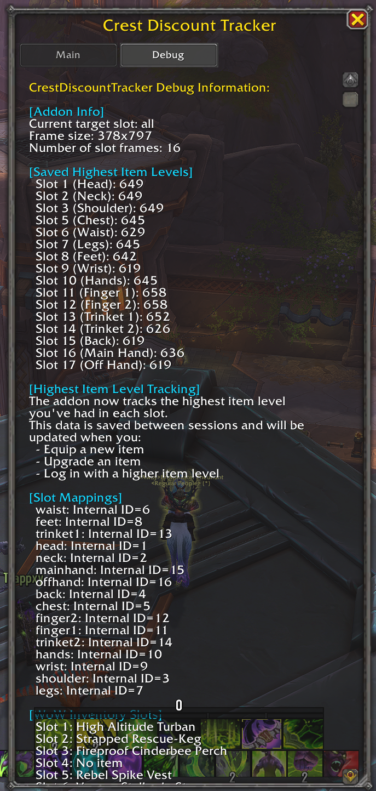

# Crest Discount Tracker

## Overview
Crest Discount Tracker is a World of Warcraft addon that helps players track their eligibility for Warband Crest discounts in The War Within expansion. The addon analyzes your currently equipped gear and shows which tier of discount you qualify for based on your item levels.

## Features
- Displays item level information for all equipped gear slots
- Calculates your eligibility for Warband Crest discounts
- Shows how many more item levels you need to reach the next tier
- Identifies your lowest item level slot to help you prioritize upgrades
- Color-coded status bars to easily see your tier progress
- Clean, organized UI with detailed tooltips
- **NEW in v2.0**: Resizable UI window for better customization
- **NEW in v2.0**: Debug tab for troubleshooting and advanced information
- **NEW in v2.0**: Persistent tracking of highest item levels across sessions
- **NEW in v2.1**: Modular file structure for better organization and maintainability

## Architecture
The addon is built using SOLID principles for better maintainability and is now organized into a modular file structure:

```
CrestDiscountTracker/
├── CrestDiscountTracker.toc
├── Core/
│   ├── Init.lua
│   ├── Constants.lua
│   └── SlotManager.lua
├── Services/
│   ├── ItemLevelService.lua
│   └── TierCalculator.lua
├── UI/
│   ├── UIFactory.lua
│   ├── UIController.lua
│   └── TooltipManager.lua
├── Data/
│   └── DataCollector.lua
└── Main.lua
```

Each module has a specific responsibility:

1. **Core/Init.lua**: Initializes the addon namespace and creates tables for Core, Services, UI, and Data
2. **Core/Constants.lua**: Defines addon-wide constants for tiers and colors
3. **Core/SlotManager**: Handles slot data and mapping
4. **Services/ItemLevelService**: Retrieves item level data from the game
5. **Services/TierCalculator**: Calculates tier eligibility and requirements
6. **Data/DataCollector**: Collects and processes slot data
7. **UI/UIFactory**: Creates UI elements
8. **UI/UIController**: Updates the UI with data
9. **UI/TooltipManager**: Manages tooltip functionality
10. **Main.lua**: Main addon controller that ties everything together

## Usage
The addon provides a simple interface with the following commands:

- `/cdt` - Opens the Crest Discount Tracker window
- `/cdt debug` - Opens the Crest Discount Tracker window with the debug tab active
- `/cdt close` - Closes the addon window
- `/crestdiscounttracker` - Alternative to `/cdt`

## UI Features

### Main Tab
The main tab displays your current item level information and discount eligibility:
- **Enhanced Summary Section**:
  - Average item level across all equipped gear
  - Lowest item level slot (your upgrade priority)
  - Current Warband Crest discount tier eligibility
  - Item level needed to reach the next discount tier
  - Visual progress indicator toward next tier threshold
- Table of all gear slots with current and highest recorded item levels
- Color-coded status bars indicating tier progress
- Resizable window with drag handle in the bottom-right corner

### Debug Tab
The debug tab provides detailed information for troubleshooting:
- Addon information (current target slot, frame size, etc.)
- Saved highest item levels for each slot
- Slot mappings showing internal IDs
- WoW inventory slot information with equipped items
- Current slot data with detailed item level information

## Highest Item Level Tracking
The addon tracks the highest item level you've had in each slot, even if you're not currently wearing that item. This data is:

- Saved between game sessions
- Updated automatically when you equip new items
- Updated when you upgrade existing items
- Used to calculate your tier eligibility

## Planned Features
Based on The War Within's gear upgrade system, we're considering adding these features in future updates:

### Upgrade Cost Tracking
- Track the gold cost for upgrading each piece of gear to the next tier
- Calculate total gold needed to reach the next discount tier
- Compare upgrade costs against potential savings from higher discount tiers

### Upgrade Material Tracking
- Track Whelpling's Shadowflame Crest currency amounts
- Display how many Crests you need for your next important upgrade
- Show weekly caps and your progress toward them

### Gear Set Optimization
- Suggest which gear pieces to upgrade first for maximum efficiency
- Calculate "what if" scenarios for different upgrade paths
- Identify which gear slots would benefit most from Mythic+ or raid drops

### Upgrade History
- Track your upgrade history over time
- Show gold spent on upgrades
- Display item level progression by slot

### Vault Reward Evaluation
- Evaluate Great Vault rewards against your current gear
- Calculate the value of potential upgrades from weekly vault rewards
- Suggest which vault reward would provide the biggest item level improvement

## Warband Crest Tiers
The addon tracks your eligibility for the following tiers:

1. **Gilded of the Undermine** (675+ item level) - 33% discount
2. **Runed of the Undermine** (662+ item level) - 33% discount
3. **Carved of the Undermine** (649+ item level) - 33% discount
4. **Weathered of the Undermine** (636+ item level) - 33% discount

## Available Slots
head, neck, shoulder, back, chest, waist, legs, feet, wrist, hands, finger1, finger2, trinket1, trinket2, mainhand, offhand

## Requirements
- World of Warcraft: The War Within
- Works best on Retail WoW

## Installation
1. Download the addon
2. Extract the folder to your World of Warcraft\_retail_\Interface\AddOns directory
3. Ensure the folder is named "CrestDiscountTracker"
4. Restart World of Warcraft or reload your UI (/reload)
5. The addon will appear in your addon list with its icon

## Screenshots

<details>
  <summary><strong>Main Tab Screenshot (Click to expand)</strong></summary>
  
  
</details>

<details>
  <summary><strong>Debug Tab Screenshot (Click to expand)</strong></summary>
  
  
</details>

## Author
Paul Gower

## Version
2.1.0

## Changelog
### v2.1.0
- Refactored the addon into a modular file structure for better organization
- Fixed error with unknown event "ITEM_UPGRADE_MASTER_UPDATE"
- Fixed nil value error when calling GetInventorySlotID function
- Added proper inventory slot ID mapping in UIFactory
- Improved event handling with PLAYER_ENTERING_WORLD event
- Enhanced debug information display

### v2.0.0
- Added resizable UI window with minimum and maximum size constraints
- Added debug tab with detailed information for troubleshooting
- Added persistent tracking of highest item levels across sessions
- Fixed slot ordering to correctly position the back slot as slot 4
- Renumbered mainhand and offhand slots to 15 and 16 respectively
- Improved UI layout and responsiveness
- Added custom tab system for better compatibility across WoW versions

### v1.0.0
- Initial release with basic functionality
- Display of item level information for all equipped gear slots
- Calculation of eligibility for Warband Crest discounts 